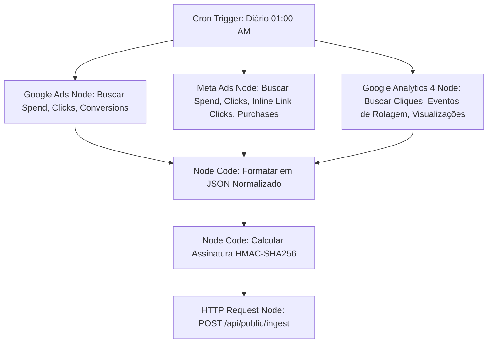

# Guia Completo: Relatório de Tráfego Multicanal & Links Compartilhados

Este guia contém as instruções passo a passo para conectar o **Google Ads**, **Google Analytics 4 (GA4)** e **Meta Ads (Facebook)** ao seu sistema e criar links públicos de compartilhamento para seus clientes.

---

## 1. Seu Novo Projeto Supabase está Pronto!

Eu criei um novo projeto no Supabase chamado **`insight-ai-hub`** na região **`sa-east-1` (São Paulo)** e já configurei todas as tabelas e funções necessárias.

### Credenciais do Projeto (Já Atualizadas no seu arquivo `.env` local):
* **Supabase Project ID:** `btdgetidtawjtqrvzybh`
* **Supabase URL:** `https://btdgetidtawjtqrvzybh.supabase.co`
* **Publishable API Key (Anon Key):** `sb_publishable_ajCs5VZ3suNt9i1DJBtW5w_UNqtw4xm`

---

## 2. Estrutura do Banco de Dados Criada

O banco de dados foi estruturado com as tabelas fundamentais de DW (Data Warehouse) e segurança:
1. **`clients`:** Registra seus clientes (como a agência). Adicionei a coluna `share_token` (UUID) que serve como o link secreto do cliente.
2. **`metrics_daily`:** Armazena os dados consolidados dia a dia de cada canal (gasto, impressões, cliques, conversões, receita).
3. **`metrics_raw`:** Histórico do payload bruto recebido para auditoria.
4. **`ingest_logs`:** Histórico de execuções e status das integrações de dados.

### Segurança e Acesso Público Seguro (Funções RPC):
Para que o cliente acesse os dados dele sem precisar de senha (apenas clicando no link), eu criei duas funções com privilégios de segurança (`SECURITY DEFINER`) no banco. Elas garantem que **nenhuma outra métrica** seja vazada, exceto as do cliente que possuir o token exato:
* **`get_shared_client_details(p_share_token)`**: Puxa o nome da empresa, logo e cores do cliente.
* **`get_shared_metrics(p_share_token)`**: Puxa apenas as métricas consolidada do cliente associado ao token.

---

## 3. Passo a Passo do n8n (Integração Google e Meta)

O n8n será responsável por extrair dados diariamente das APIs de anúncios e injetar no banco de dados.

### Como o Workflow no n8n deve ser configurado:



### Detalhes de Cada Integração no n8n:

1. **Google Ads:**
   * **Métricas coletadas:** `metrics.cost_micros` (converter para valor real / 1.000.000), `metrics.clicks`, `metrics.conversions`.
   * **Dimensões:** `segments.date`.

2. **Meta Ads (Facebook):**
   * **Métricas coletadas:** `spend`, `clicks`, `actions` (com foco em `link_click` e `purchase`).
   * **Dimensões:** `date_start`.

3. **Google Analytics 4 (GA4):**
   * **Métricas coletadas:** `activeUsers`, `sessions`, `screenPageViews`, `conversions`, `eventCount` filtrado por nomes de evento específicos.
   * **Eventos específicos para Cliques e Rolagem:**
     * `scroll`: Disparado automaticamente pelo GA4 quando o usuário atinge 90% da página.
     * `click`: Disparado pelo GA4 para cliques de saída.
   * **Dimensões:** `date`, `sessionSourceMedium` (para saber se o tráfego veio de ads ou orgânico).

### Enviando os dados para o InsightOS:
O nó de **HTTP Request** no final do seu n8n deve fazer um **POST** para:
`https://btdgetidtawjtqrvzybh.supabase.co/functions/v1/...` (ou para o seu servidor onde o app está hospedado, no endpoint `/api/public/ingest`).

O payload JSON enviado deve seguir esta estrutura:
```json
{
  "client_id": "ID_DO_CLIENTE_NO_BANCO",
  "source": "google_ads", // ou 'meta_ads', 'google_analytics'
  "rows": [
    {
      "metric_date": "2026-06-11",
      "scope": "account",
      "entity_id": "id-da-conta-ou-campanha",
      "entity_name": "Nome da Conta/Campanha",
      "dimensions": {},
      "metrics": {
        "clicks": 150,
        "spend": 45.20,
        "conversions": 12
      }
    }
  ]
}
```

> [!IMPORTANT]
> **Assinatura de Segurança HMAC:**
> A requisição precisa conter o cabeçalho `x-ingest-signature` gerado a partir do seu `INGEST_HMAC_SECRET` definido no ambiente. Isso impede que terceiros enviem dados falsos para a sua API.

---

## 4. Rastreamento de Cliques e Rolagem (Scroll) no Site

Se você quer medir com precisão de pixel os cliques e a rolagem das páginas dos clientes, a forma mais fácil e moderna é através do **Google Analytics 4 (GA4)**, pois ele já faz isso sem você precisar escrever código JavaScript no site do cliente.

### Como ativar no GA4:
1. No painel do GA4 do cliente, acesse **Administrador** > **Fluxos de Dados** > Selecione o site.
2. Certifique-se de que a **Medição Otimizada** está ativada.
3. Clique na engrenagem de configurações e garanta que **Rolagens** (Scrolls) e **Cliques de Saída** estão marcados.
4. Pronto! O n8n poderá extrair essas métricas diretamente da API de relatórios do GA4 puxando os eventos `scroll` e `click`.

---

## 5. Como o App vai Renderizar o Link Público do Cliente

A URL final do cliente será parecida com esta:
`http://localhost:8080/shared/e5c70752-61cc-4c12-8de9-ef6f849c719e`

### O que o Frontend faz:
1. O router detecta o `shareToken` da URL.
2. Faz uma chamada RPC `get_shared_client_details` para carregar as cores e a marca da agência/cliente.
3. Faz uma chamada RPC `get_shared_metrics` para buscar todos os dados de tráfego.
4. Exibe gráficos de linha (evolução de conversões e cliques) e de barra (comparativo de ROI/ROAS entre Google Ads vs Facebook Ads) usando `Recharts`.

---

## 6. Como Exportar este Guia para PDF

Para ter este guia sempre à mão ou enviar para sua equipe em formato PDF:
1. Se você estiver usando o **VS Code**, instale a extensão **Markdown PDF**.
2. Abra este arquivo (`guia_passo_a_passo.md`).
3. Clique com o botão direito no editor e selecione **Markdown PDF: Export (pdf)**.
4. O arquivo `guia_passo_a_passo.pdf` será gerado automaticamente na mesma pasta.
